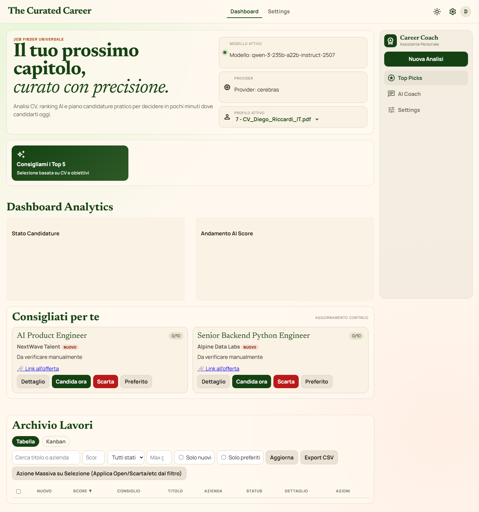
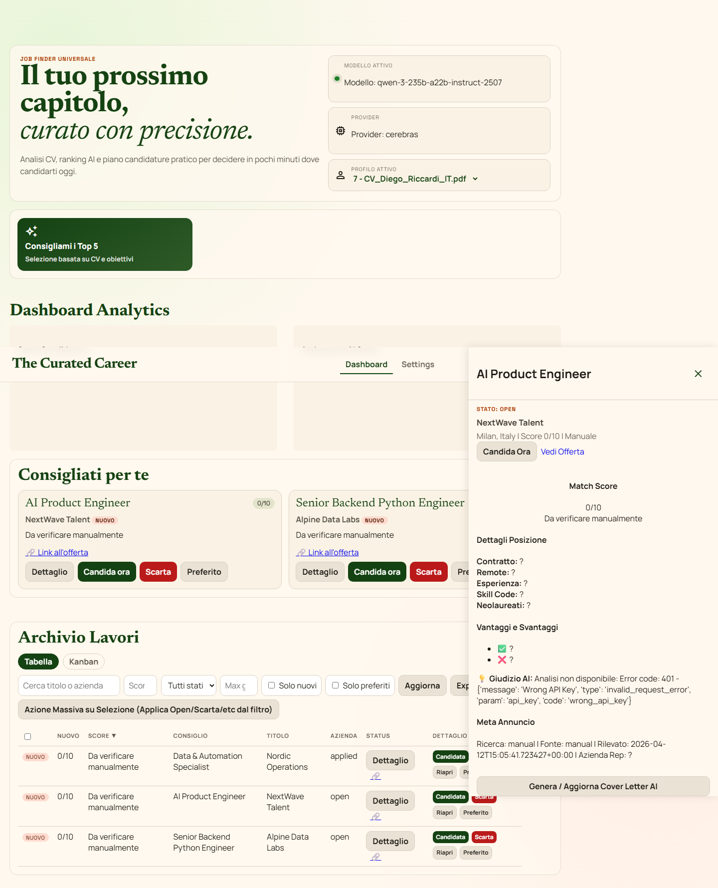
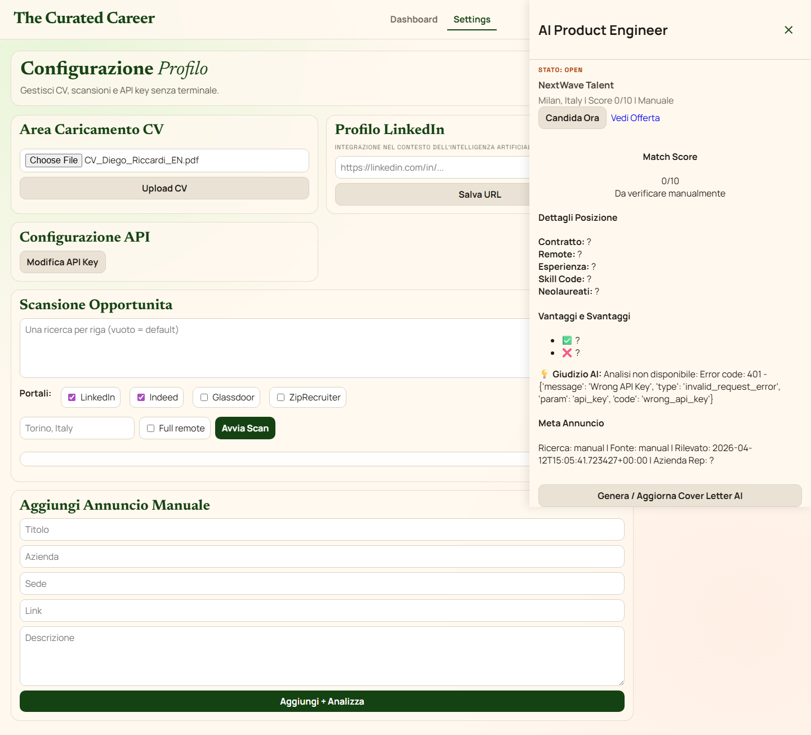
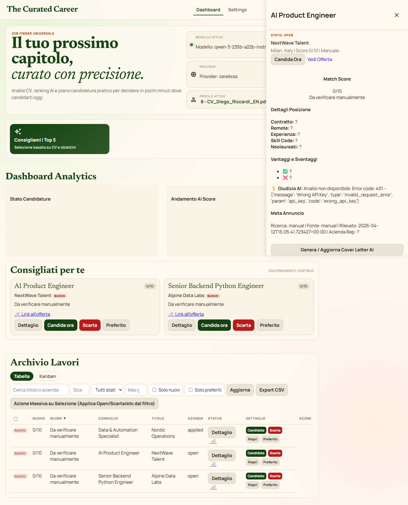

# Job Finder Universale (Pro Max Edition)

Versione potenziata della web app locale per la ricerca, l'analisi AI e la gestione delle candidature.

Obiettivo: cercare lavori, analizzarli con AI, gestire lo stato tramite Kanban, estrarre Analytics e usare il Chat Coach In-Place.
Uso previsto: Personale (ogni utente esegue l'app sul proprio computer, con i propri dati locali).

## Novita della Versione "Pro Max"
- **UI All-in-One**: La navigazione è stata unificata. Niente piu tab "Discover" full-page. I dettagli annuncio si aprono comodamente in un **Pannello Offcanvas** laterale scorrevole.
- **Vista Kanban**: Trascinamento Drag & Drop nativo. Organizza i lavori in colonne: *Open*, *Applied*, *Interviewing*, *Rejected*.
- **Analytics Dashboard**: Grafici Chart.js per monitorare statistiche di stato e distribuzione dell'AI Match Score.
- **Server-Sent Events (SSE)**: La scansione dei portali (LinkedIn, Indeed, ecc.) non blocca piu la pagina. Una barra di caricamento Overlay mostra il progresso reale dello scraping in background.
- **Dark Mode Nativa**: Toggle istantaneo tra Light e Dark mode (`[data-theme="dark"]`).
- **Toast Notifications**: Feedback non intrusivi (errori, successi, info) senza i vecchi alert bloccanti.

## Cosa c'e nella cartella

- `app/`: backend FastAPI e logica applicativa
- `web/`: interfaccia browser
- `run_webapp.py`: script launcher
- `requirements.txt`: dipendenze runtime Python
- `package.json` / `playwright.config.js`: setup test E2E
- `README.md`: questa guida

## Screenshot Reali Desktop (CV IT + EN)

Queste immagini sono generate con test automatici Playwright usando PDF locali.

**Dashboard Tabellare / Kanban (Dark/Light Mode)**



**Dettaglio Offcanvas con Generatore Cover Letter**



**Impostazioni e Provider LLM Multipli (CV EN)**



**Visualizzazione Statistiche & Analytics**



*(Tutte le interfacce si adattano dinamicamente al profilo CV inserito)*

## Requisiti

- Python 3.11+
- Node.js (solo per test E2E opzionali)
- Almeno una API key LLM, impostabile dalla pagina web (Groq, OpenAI, Anthropic, Cerebras, Google)

## Setup rapido (Prima esecuzione)

1. Crea e attiva un virtual environment:
```powershell
python -m venv .venv
.\.venv\Scripts\Activate.ps1
```
2. Installa dipendenze:
```powershell
pip install -r requirements.txt
```
3. Avvia l'app:
```powershell
python run_webapp.py
```
4. Apri nel browser: **http://127.0.0.1:8000**
5. Inserisci le tue API Key nel tab "Settings".

## Funzionalita Principali

1. **Gestione CV**: Carica il tuo CV in PDF, DOCX o TXT per fornire il contesto all'AI.
2. **Kanban & Drag'n'Drop**: Sposta le schede candidatura da "Open" ad "Applied" o "Rejected".
3. **Scansione Streaming**: Digita job title e location, e guarda l'output real-time scorrere grazie ai Server-Sent Events (SSE).
4. **Offcanvas Dettaglio**: Clicca "Dettagli" per aprire la scheda laterale. Include Score, consigli, URL offerta e bottone per generare la *Cover Letter*.
5. **AI Career Coach**: Pannello Chat integrato in basso a destra. Chiedi analisi o mock interview.

## Test E2E con Playwright (Per rigenerare gli screen)

Se modifichi l'interfaccia e vuoi aggiornare gli screenshot di questa documentazione:

```powershell
npm install
npx playwright install chromium
npm run test:e2e
npx playwright test tests/e2e/readme-cv-showcase.spec.js
```

## Dati locali e backup

L'intero database SQLite risiede in:
- `data/searcher.db`

Backup consigliato prima di procedere con l'aggiornamento del codice (copia la cartella `data/`).
